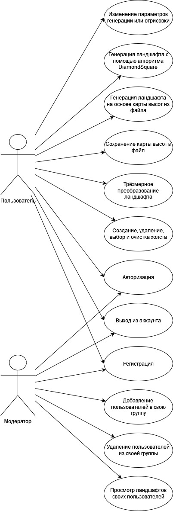
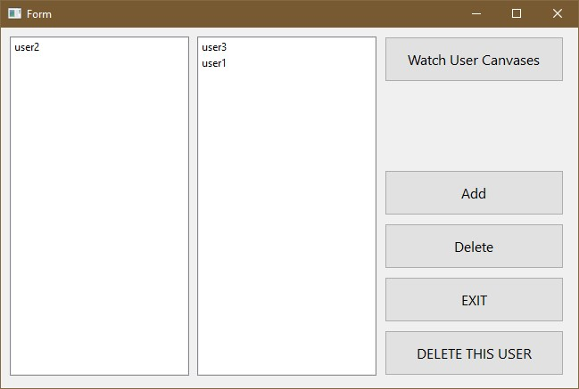
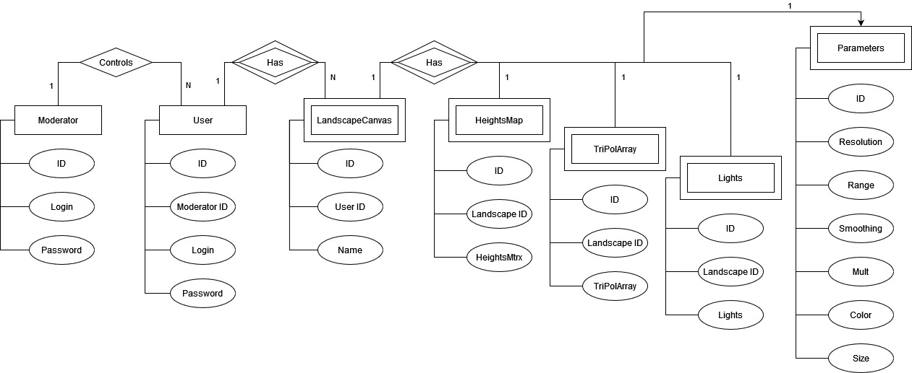

# Лабораторная работа №1
## Название проекта
Генерация и визуализация трёхмерного ландшафта.
## Краткое описание идеи проекта
Разработать программу генерации и построения трехмерного изображения ландшафта. Предусмотреть возможность визуализации ландшафта, на основе случайно сгенерированной карты высот. Интерфейс должен обеспечить ввод таких параметров генерации ландшафта, как размерность карты высот, максимальную высоту, цвет для закраски поверхности ландшафта. Предоставить возможность трехмерных преобразований визуализируемой сцены: сдвиг, поворот, масштабирование. При генерации ландшафта добавляется статический (относительно ландшафта) источник света.
## Краткое описание предметной области
Компьютерная (машинная) графика – это создание, хранение и обработка моделей объектов и их изображений с помощью ЭВМ. Основные задачи компьютерной графики это синтез, анализ и обработка изображения.
## Краткое обоснование целесообразности и актуальности проекта
Генерация ландшафта постоянно используется при моделировании трехмерных виртуальных сцен. Подобные сцены используются в фильмах с использованием компьютерной графики, трехмерных играх или в качестве демонстрационного материала для различных архитектурных объектов. В кинематографе трехмерные ландшафты применяются, например, для создания сцен больших размеров, ручное моделирование которых оказалось бы нецелесообразно. Компьютерные игры используют методы генерации ландшафтов для создания уникальных игровых миров. Инструменты для моделирования ландшафтов зачастую являются частью крупного программного продукта, установка и освоение подобных программ может быть довольно сложным процессом. Они позволяют сэкономить время для художника, способствуют быстрой итерации изменений.
## Use-Case - диаграмма

## Экраны будующего интерфейса

## ER-диаграмма сущностей
